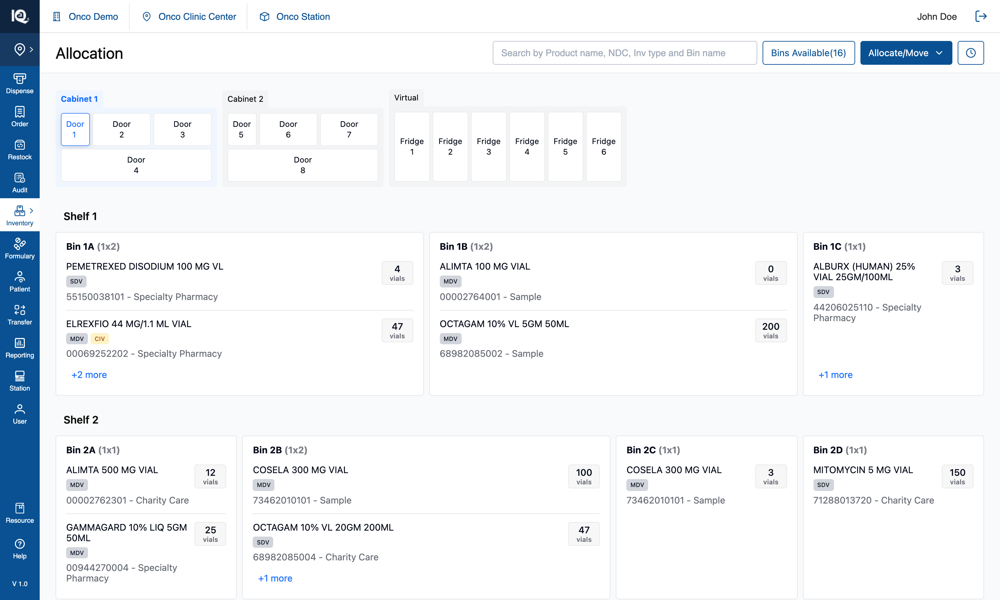
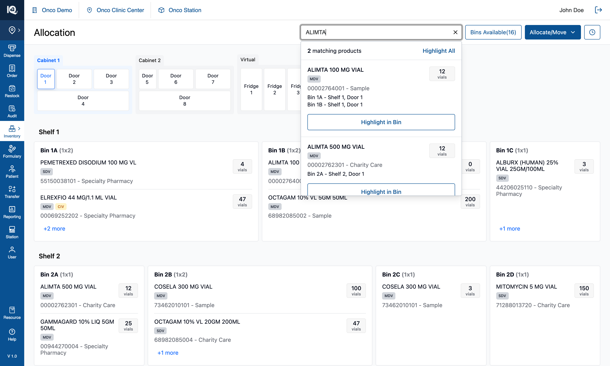
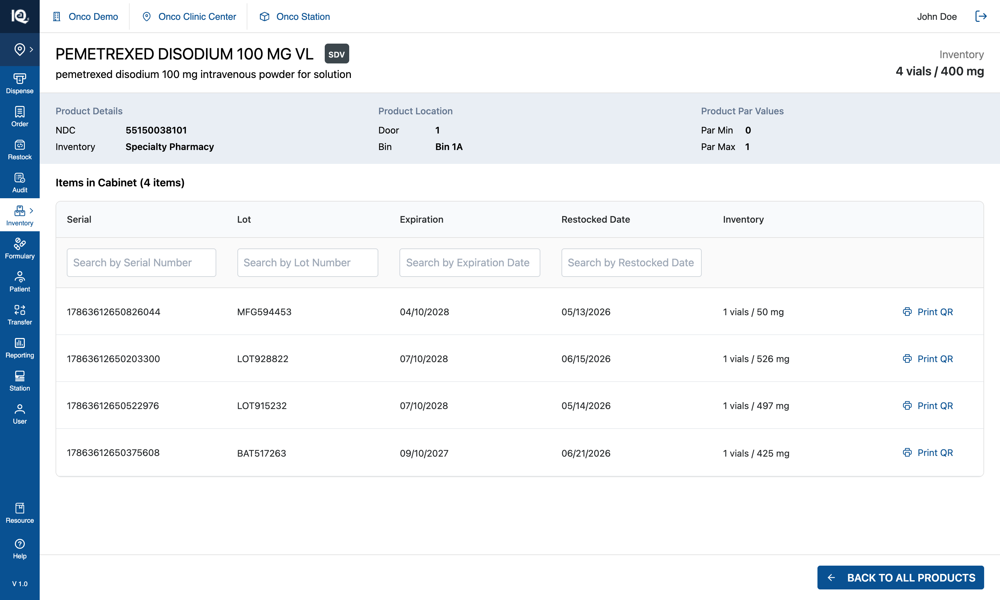

# 00 — Introduction

**Module:** Bin Allocation 2.0 — the Allocation page under Inventory
**Prototype:** React 18 + Vite + TypeScript + Tailwind 4, no backend
**Captured:** 2026-08-10 · seed data unmodified · screenshots at 1512×908

Read this before the feature documents. It covers the model the whole module rests on — cabinets,
doors, bins and product rows — how the operator moves around it, what search does, and which parts of
the screen are real behaviour versus placeholder. Each feature document then assumes this context.

---

## Default state {copy}



The Allocation page opens on **Cabinet 1, Door 1**, with that door's four shelves listed below the
cabinet strip and every bin on them drawn as a card. The cabinet strip is the module's map: three
cabinets side by side — Cabinet 1 (Doors 1–4), Cabinet 2 (Doors 5–8) and Virtual (Fridge 1–6) — and the
open door is outlined in blue. Each bin card shows its name and footprint, then a row per product it
holds, each row carrying the drug name, its badges, `NDC - inventory type` and a quantity chip.

From here the operator can tap any door to open it, tap a cabinet's header to move the highlight to
that cabinet, tap `+N more` on a bin card to read the products a card had no room for, tap a product
row to open its detail page, search from the header, press `Bins Available(n)` to mark the empty bins,
open `Allocate/Move` to start one of the four workflows, or open History. Browsing is non-destructive:
nothing on this screen changes inventory, and the four workflows are the only way to do that.

## Search in View Mode {copy}



Typing three or more characters in the header search opens a dropdown of matches, in two sections —
**matching bins** first (by bin name), then **matching products** (name, NDC, source, inventory type or
generic name). Each product row states where that drug actually lives, one line per bin, which is
usually the answer the operator came for: `Bin 1A - Shelf 1, Door 1`.

From here the operator can press `Highlight in Bin` on a product to light up every bin holding it,
`Highlight Bin` on a bin row to light that one bin, or `Highlight All` in either section header to
light every match at once. Highlighting is how the canvas answers a search: matched bins take an amber
outline, the matched text inside them is tinted, and doors holding a match carry an amber dot on the
cabinet strip — so a hit behind a closed door is still visible. In View Mode nothing in this dropdown
selects or changes anything; it only points. Typing alone does not mark the canvas either — the
operator has to choose a row, which is what separates "what I am looking for" from "what I found".

## Product details {copy}



Tapping a product row anywhere in View Mode — on a bin card or in the `+N more` panel — replaces the
page with that product's detail view: name, generic name and badges, its total on hand, the NDC and
inventory type, the door and bin it was opened from, and a table of the individual items in that bin
with serial, lot, expiry and restock date.

From here the operator can search the item table by serial, lot, expiry or restock date, and return with
**Back to all products**, which comes back to the cabinet exactly as they left it. Each item row also
offers `Print QR`, which is **not wired up** in the prototype — the button renders and does nothing. One conditional control: when the product's quantity is **0**, an `Unallocate` action
appears, which releases the bin — the only inventory change reachable from this page, and the same act
the zero-inventory banner offers after a move empties a bin. A product row is only a link **outside** a
workflow; inside one, the same row either selects that product or does nothing (§2).

---

## 1. The cabinet model

### 1.1 Hierarchy

```
Cabinet ──> Door ──> Shelf ──> Bin ──> Product row
```

| Level | In the seed | Notes |
|---|---|---|
| Cabinet | 3 — Cabinet 1, Cabinet 2, Virtual | Virtual is the fridges; a 4th (Emergency Kit) exists in data but is hidden |
| Door | 14 — Doors 1–8 in the two cabinets, Doors 9–14 as Fridge 1–6 | Fridges are labelled `Fridge N` (door number − 8) |
| Shelf | 4 per cabinet door; none for a fridge | A fridge holds one pooled bin and no shelf structure |
| Bin | **134** — 128 across the cabinet doors, 6 pooled fridge bins | 16 are empty in the seed |
| Product row | **385** across those bins | The same drug in two bins is two rows |

### 1.2 Per-door configuration

| Door | Shelves | Bins | Empty | Footprints |
|---|---|---|---|---|
| Door 1 | 4 | 15 | 1 | 10 × 1x1, 5 × 1x2 |
| Door 2 | 4 | 15 | 2 | 4 × 1x1, 4 × 1x2, 7 × 2x2 |
| Door 3 | 4 | 15 | 2 | 2 × 1x1, 7 × 1x2, 6 × 2x2 |
| Door 4 | 4 | 16 | 2 | 4 × 2x2, 8 × 2x3, 4 × 3x3 |
| Door 5 | 4 | 18 | 3 | 16 × 1x1, 2 × 1x2 |
| Door 6 | 4 | 15 | 2 | 4 × 1x1, 4 × 1x2, 7 × 2x2 |
| Door 7 | 4 | 18 | 2 | 4 × 1x1, 10 × 1x2, 4 × 2x2 |
| Door 8 | 4 | 16 | 2 | 4 × 2x2, 8 × 2x3, 4 × 3x3 |
| Fridge 1–6 | — | 1 each | 0 | one pooled bin |

Three door **types** drive that geometry, and each shelf of a door is laid out to the same grid:

| Type | Doors | Grid per shelf |
|---|---|---|
| single | 1, 5 | 1 row × 5 columns |
| double | 2, 3, 6, 7 | 2 rows × 5 columns |
| bottom ("unique") | 4, 8 | 5 rows × 5 columns — the wide door at the base of the cabinet |

A footprint is named `rows x cols`, so a `1x2` spans two columns of one row and a `2x3` is three
columns across two rows. Rotations keep the name, which is why the renderer measures `gridPosition`
(width = columns, height = rows) rather than the size label.

### 1.3 Bin naming

`Bin 1A`, `Bin 1B` on shelf 1; `Bin 2A` on shelf 2 — **the bin name carries its shelf**, generated at
seed time rather than imported. Uniqueness is scoped to the **door**, which is the unit that has to be
unambiguous because all of a door's shelves are on screen together. Across doors the label repeats:
`Bin 1A` names eight different bins in this seed, which is why anything listing bins outside one door
qualifies them as `Door 3 - Bin 1A`.

Fridge bins keep their imported name and their card omits the bin header entirely — one pooled bin has
nothing to be told apart from.

### 1.4 Product identity

A product is identified by **name + NDC + inventory type**, never by `product.id`: the same drug in
three bins is three rows with three different ids. Everything user-facing — search grouping, counters,
badges, de-duplication — keys on that triple. The four inventory types in the seed are Purchased,
Sample, Charity Care and Specialty Pharmacy, and the badges (`SDV`/`MDV`, `CLIMATE`, `CIV`) are derived
from a hash of the identity triple so a drug looks the same everywhere it appears.

---

## 2. Interaction model

Everything on the canvas is a tap target whose meaning depends on the mode. In View Mode:

| Tap | Result |
|---|---|
| A cabinet header | Selects that cabinet (highlight only — no door opens) |
| A door | Opens it: its shelves and bins replace the ones below, and its cabinet becomes selected |
| A bin card | Selects the bin — a blue outline, nothing more (see §5) |
| A product row | Opens that product's detail page |
| `+N more` | Opens a side panel listing every product in that bin |
| A door dot | Not a control — an indicator that this door holds a search match or an empty bin |

Inside a workflow the same taps mean different things, which is the single most important thing to
carry into the feature documents:

| Tap | Allocate Product / Multi Bin Assignment | Move from Bin, step ① | Move from Product, step ① | Either move, step ② |
|---|---|---|---|---|
| Bin card | Picks the bin to allocate into | Picks it as **Move From** | Refused, with a toast explaining why | Picks it as **Move To** |
| Product row | Inert — the tap has to mean the bin | Inert | Selects that product in that bin | Inert |

Two rules behind that table:

- **The operator declares the unit up front.** A move is started as either *Move from Bin* or *Move from
  Product*, and that choice — not the shape of the data — decides whether a bin tap or a product tap is
  the meaningful one. Nothing is inferred.
- **A refused tap explains itself.** Tapping a bin during a Product move, or a product in the `+N more`
  panel during a move, raises a toast naming the control that would have worked. A rule enforced in
  silence is indistinguishable from a broken control.

---

## 3. Navigation patterns

There is **no router**. The module is one page whose content is switched by boolean state, and it is
worth knowing that up front because it shapes what "back" means:

| Surface | How it opens | How it leaves |
|---|---|---|
| Cabinet browse | The default | — |
| Product detail | Tapping a product row | `Back to all products` |
| History | The clock button in the header | `Back` |
| Move pipeline (4 steps) | `Allocate/Move` › a Move entry | `Cancel`, which discards the move |
| Side panels — allocation, `+N more`, move summary | Their own trigger | Their `X` or `Cancel` |

Three patterns hold across all of them:

- **Full pages for full tasks, panels for context.** Anything that changes inventory takes over the
  page — the move pipeline's four steps and the review screen are pages, not dialogs. Panels (440px on
  the right for allocation, 320px for the move summary) are for choosing and checking while the canvas
  stays visible behind them.
- **Layering is fixed:** side panels at `z-70`, overlays those panels own at `z-80`, toasts at `z-100`
  top-right, so a message raised while a panel is open is never hidden behind it.
- **Leaving a flow discards it.** There is no draft state and nothing is saved part-way, which is why
  `Cancel` and `Back` are ordinary blue secondary buttons rather than destructive red, and why the
  header's workflow entry points hide while a flow is open.

---

## 4. How search works

Three query channels exist and are deliberately independent. Conflating them has been the source of
most historical bugs here:

| Channel | Means |
|---|---|
| Typed query | What is in the box right now |
| Highlight query | What the canvas is marking — set only by choosing a dropdown row |
| Source query | Which products a workflow's selection is scoped to |

**Nothing on the canvas reads the typed text.** The bin outlines, the door dots and the match count all
read the highlight channel, so typing narrows the dropdown and marks nothing until a row is chosen.

The query grammar: terms are separated by whitespace **or** commas, interchangeably, and every term
must appear in *some* searchable field, not the same one — which is what makes `carbo purchased` work
(the name answers one term, the inventory type the other). Minimum query length is **3 characters**, so
a two-character bin name like `1A` finds nothing.

Bin hits match on **bin name only**, deliberately: a bin holding a matched product would otherwise
appear in both sections as two answers to one question. Products are the product section's job.

---

## 5. What the module does not model

Four of these look like they exist. They do not, and building against them as if they do is the most
likely way to misread the prototype:

| Concept | Reality |
|---|---|
| **Par levels / min-max** | Not modelled. The product detail page prints `Par Min 0` / `Par Max 1` — those two numbers are **hardcoded in the markup**, not read from any product. |
| **Bin capacity / "bin is full"** | No runtime concept of fullness, so no capacity conflict can be raised. The only capacity is a seed-time layout calculation. |
| **Product fits bin** | Inverted: a bin's footprint is *derived from how much it holds* at seed time. Products have no footprint. |
| **Door-type routing** | Nothing stops a climate-sensitive product being allocated to a room-temperature door. The seed keeps cold stock in the fridges, but that is data, not enforcement. |
| **Serial number validation** | Serials are *counted*, never checked against anything. |

The one real domain rule is the **Emergency Kit rule**: E-Kit bins accept only `Purchased` inventory,
enforced on the bin tap and again at confirm.

Two more pieces of the detail page are placeholder and must not be implemented as behaviour: the item
table's serial, lot, expiry and restock values are **generated at render time** (one row per unit of
quantity, with a random mg figure), and the header's total reads `quantity × 100 mg` regardless of the
drug's real strength.

Also inert: the left navigation rail and the top bar's practice/clinic switchers are visual only. The
rail's Inventory entry opens a small menu of views, which sets local state and changes nothing.

---

## 6. Data and persistence

There is no backend, no persistence and no auth. All inventory lives in React state seeded from a
static file, which means **a page reload discards every allocation, move and unallocation**. If the
cabinet ever looks wrong while you are exploring, reload before investigating — you may be looking at
your own earlier clicks.

For the real build, two consequences matter most:

- Every count on screen (bins available, products in a bin, quantities) is derived from that one
  in-memory structure, so nothing can disagree. Once these come from an API, the derivations have to
  stay single-sourced or the header and the canvas will drift apart.
- The prototype's ids are seed artefacts. Bin ids look like `door1_shelf1_slot1`, and product row ids
  are per-row, not per-drug. Neither should be treated as a stable key from a real system — use the
  identity triple (§1.4).

---

## 7. Where to go next

| Feature | Document |
|---|---|
| Bins Available — the availability filter and count | [01-Bins-Available.md](01-Bins-Available.md) |

The four workflows behind `Allocate/Move` — Allocate Product, Multi Bin Assignment, Move from Bin and
Move from Product — and the History ledger are documented one at a time, each assuming this
introduction.
