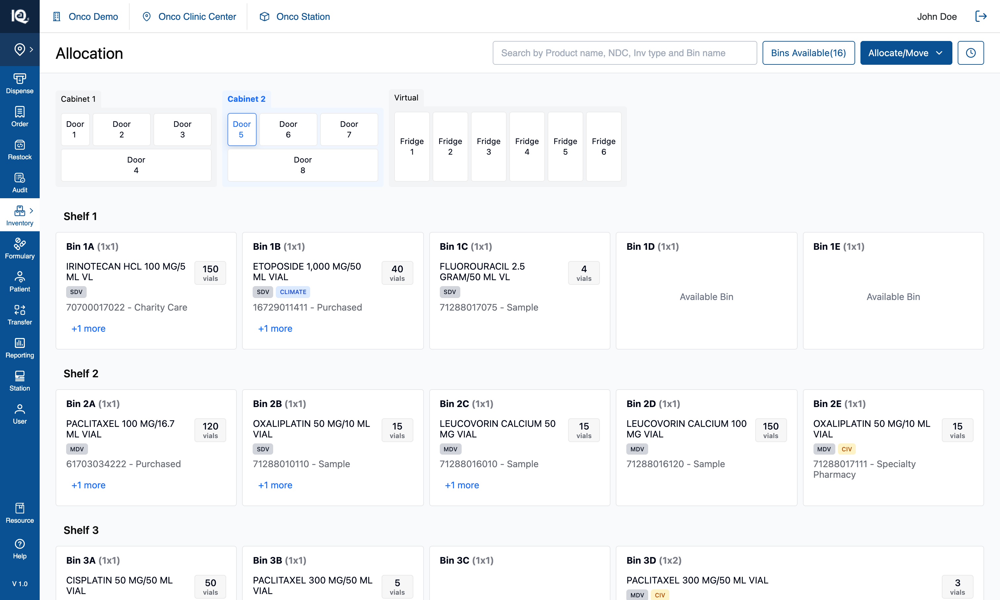
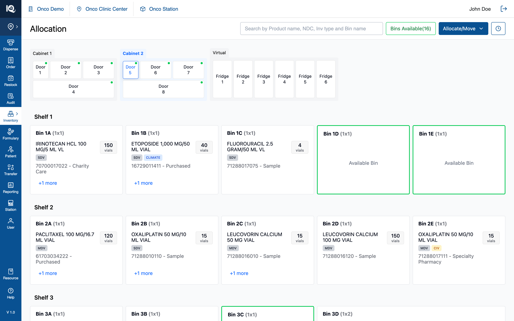

# 01 — Bins Available

**Surface:** Allocation page header (right-aligned control group)
**Control:** `Bins Available(n)` — a toggle button
**Prototype files:** `HeaderSection.tsx`, `DoorIndicators.tsx`, `BinCard.tsx`, `doorUtils.ts`, `useInventoryState.ts`
**Captured:** 2026-08-10 · prototype at `bins-available-visible-in-workflows`, seed data unmodified

---

## Default state {copy}

The Allocation page as it loads, with the availability filter off. `Bins Available(16)` already states
how many bins across every cabinet and fridge are empty and able to take stock — the count is live and
is never gated on the filter, so the operator has the number without asking for it.

From here the operator can read that count, switch cabinets and doors to browse what each bin holds,
search for a product or a bin, or open `Allocate/Move` to start a workflow. Empty bins read
"Available Bin" in their card body, but nothing is marked out on the canvas: finding the free ones
means opening doors and looking. Pressing `Bins Available(16)` is what answers that in one step.

## Interaction state {copy}

The same door after one press of `Bins Available(16)`. The control turns green, every door holding at
least one free bin gains a green dot, and every empty bin behind the open door gains a green outline.
Nothing is hidden and no count changes — the filter marks what is already there, so the operator can
see at a glance which doors are worth opening rather than checking them one at a time.

From here the operator can pick a door by its dot, tap an outlined bin exactly as they would with the
filter off, and press the control again to turn the marking off. The state also holds while a workflow
is open: `Bins Available` stays in the header during Allocate Product, Multi Bin Assignment and both
Move flows, so free bins can be marked and then chosen as an allocation target or a Move To without
leaving the flow. A bin the workflow has claimed shows the workflow's own colour instead — the
availability outline yields, so "free" and "already chosen" never look the same.

---

## 1. What the feature is

One control doing two jobs:

1. **It reports a number** — how many bins across the whole cabinet estate are empty and therefore able
   to take an allocation. Always visible, independent of the toggle.
2. **It is a view filter** — pressed, it marks those bins on the canvas.

It is **not** a workflow. It starts nothing, commits nothing, and mutates no inventory. It answers
"where can I put something?" — before opening `Allocate/Move`, and increasingly *during* it (§2.5).

---

## 2. Behaviour

### 2.1 The control

| State | Border | Label | `aria-pressed` |
|---|---|---|---|
| Off (default) | `#095192` (app blue) | `#095192` | `false` |
| On | `#22C55E` (`border-green-500`) | `#15803D` | `true` |

- Outlined in both states, never filled. Filled-green was tried and read as a pressed button rather
  than a live filter.
- The green stroke is **exactly** the stroke an available bin card gets, so the control and its effect
  read as one thing.
- The label green is deliberately one step darker than the stroke: `#22C55E` is 2.3:1 as 14px text on
  white, under the ~4.5:1 this app holds text to; `#15803D` is 5.02:1. **Do not collapse the two greens
  into one value.**
- `h-9`, radius 4px, matching the `Allocate/Move` primary beside it.
- `aria-pressed` carries the state for anyone not reading colour.

### 2.2 The count

- Format `Bins Available(16)` — no space before the parenthesis.
- Counts every bin with `available === true` across **all doors of all cabinets**, including the six
  Virtual/fridge doors.
- Live: allocating into an empty bin decrements it; a move or unallocation that empties a bin and is
  then unallocated increments it.
- Current seed: **16** — Door 1 has 1, Door 5 has 3, the other six cabinet doors 2 each, fridges 0.

### 2.3 Door dots (cabinet level)

- A 6px `#00C951` dot at the tile's top-right, on any door with at least one free bin.
- **Binary, not a count.** A number was built and withdrawn: at cabinet level the question is which
  doors to walk to, and a door with room is a door with room. The count survives as the dot's
  accessible name — `aria-label="3 bins available"` — so the indicator is not colour-and-shape only.
- Persists on the currently selected door.
- **Suppressed while a bin-assignment flow has bins selected on that door** — the purple allocation
  indicator wins, because that door is showing a live selection.
- The search-match dot and this dot can show together; search sits left, availability right.
- All four door shapes (three in `CabinetComponent`, the fridge in `VirtualCabinetComponent`) render
  one `DoorIndicators` component. They previously hand-rolled the same SVG at four different offsets,
  which is why they had drifted apart.

### 2.4 Bin outlines (door level)

- 2px solid `border-green-500`, on bins with `available === true` only.
- The empty bin's `Available Bin` body text renders with the filter off too. **The filter adds the
  stroke, nothing else.**
- Stocked bins are untouched in both states.

**Stroke precedence.** A card carries one stroke. Strongest first:

1. Move source (blue) / move target (green `border-green-600`)
2. Assignment selection (purple `#8F48D2`)
3. Selected bin (blue)
4. **Availability outline (this feature)**
5. Search highlight (amber `#A16207`)

The availability outline yields to 1–3 explicitly in `BinCard`. This matters because both it and the
move-target stroke are green: without the guard, which one wins comes down to stylesheet order, and a
bin the operator had already committed as a Move To would still read as free.

### 2.5 The control stays visible inside every workflow

`Allocate/Move` and `History` hide while the Unallocated tray, an assignment panel, or a move pipeline
is open. **This control does not.**

That is a deliberate reversal (2026-08-10). The hide-everything rule is about *entry points* — a second
door into a workflow invites abandoning a half-built selection — and this control opens nothing. "Where
is there room?" is at its most useful precisely while allocating or picking a Move To. Hiding it did
not even turn the filter off: the outlines stayed on the canvas with no way to clear them until the
workflow was cancelled.

Two consequences an implementer must preserve:

- The filter is togglable mid-workflow, so an available bin can be marked *and* picked as a Move To in
  the same breath. That is what §2.4's precedence guard exists for.
- With `Allocate/Move` and `History` hidden, the header has room for this control even against an open
  440px side panel at 1440px wide. Check that at narrower widths if the header gains anything.

### 2.6 What the filter does not do

- Does not hide anything, at any level.
- Does not change what a bin tap does. An outlined bin behaves exactly as it would with the filter off.
- Does not survive a reload (§4).
- Has no keyboard shortcut.

---

## 3. Implementation in the prototype

| Concern | Where |
|---|---|
| Toggle state | `highlightAvailableBins` — `useInventoryState.ts` |
| Toggle handler | `handleAvailableBinsClick` — `useInventoryState.ts` |
| Count | `getAllAvailableBins(doorShelfConfig)` — `utils/doorUtils.ts`, memoised in `App.tsx` |
| Doors with room | `getDoorsWithAvailableBins` — `utils/doorUtils.ts` |
| Per-door counts | `getFreeBinCountByDoor` — `utils/doorUtils.ts` (feeds the dot's `aria-label` and Demo Mode's door anchors) |
| Button | `HeaderSection.tsx` — outside the workflow guard, unlike `Allocate/Move` and `History` |
| Door dot | `DoorIndicators.tsx`, used by `CabinetComponent` and `VirtualCabinetComponent` |
| Bin outline | `BinCard.tsx`, prop `highlightAvailable`, threaded `ShelvesSection → ShelfLayout → BinCard` |

### 3.1 Where `bin.available` comes from

Derived from emptiness, always — there is no separate "reserve a bin" concept:

- set `false` when products are added to a bin
- recomputed as `updatedProducts.length === 0` when products are removed

A bin is available exactly when it holds zero product rows.

### 3.2 Available ≠ zero quantity

A bin holding a product row with `quantity: 0` is **not** available — the product still occupies it.
This is what the zero-inventory banner exists to resolve: after a move empties a product, the operator
is offered the chance to unallocate it, and only then does the bin become available and the count
increment.

Two consequences:

- The count must be derived from **allocation**, not stock on hand. A backend returning "bins with 0
  quantity" gives a different, wrong number.
- Multi Bin Assignment opens a new location at `quantity: 0`, so that bin is immediately unavailable
  even though nothing has physically arrived in it.

---

## 4. Data and persistence

No backend. `doorShelfConfig` is React state seeded from a static file, so the count and every
allocation are in-memory and **a reload discards them**. `highlightAvailableBins` is component state —
off on every fresh load, not deep-linkable.

For the real build:

- The count should come from the same source of truth as the cabinet contents — derived from the loaded
  configuration or computed server-side, not fetched separately, or the badge and the canvas can
  disagree.
- The toggle is a pure view preference. Persisting it per user is optional; if persisted, not per door.

---

## 5. Notes and open questions

### 5.1 Fridges never show availability — confirmed as expected

Each fridge door holds one pooled bin, and in this seed that bin is stocked, so no fridge shows a dot.
Confirmed correct by the product owner (2026-08-10). The per-door counts are threaded into
`VirtualCabinetComponent` anyway, so emptying a fridge lights its door properly rather than silently.

Still worth settling against real data: if fridges stay a **pool** rather than a set of slots,
"available" may be the wrong question for them, and they should arguably be excluded from the count
with the label saying so. Today they are counted and simply always contribute 0.

### 5.2 No capacity model behind the word "available"

"Available" means **empty**, nothing more. The domain models no par levels, no bin capacity, no product
footprint, and no door-type routing (`isFridgeDoor` only picks a layout). A bin holding one vial is
"unavailable", while a large empty bin and a small empty bin are indistinguishable to this control. If
the real system has capacity, restate this control's meaning before reusing it — likely as "bins with
room", with a different derivation.

### 5.3 Accessibility

- `aria-pressed` on the toggle — correct, keep it.
- The door dot carries `aria-label="N bins available"`, so cabinet-level availability is not
  colour-and-shape only.
- The bin outline is colour-only, but the card already reads "Available Bin" as text, so nothing is
  lost.
- Contrast: label `#15803D` on white is 5.02:1 (AA for normal text). The `#22C55E` stroke and `#00C951`
  dot are non-text and pass the 3:1 requirement.

### 5.4 Test assertions worth writing

1. Count equals the number of bins with zero product rows, across every door of every cabinet,
   including virtual.
2. Allocating into an empty bin decrements the count by one; unallocating the last product from a bin
   increments it by one.
3. A move that empties a source bin does **not** increment the count until the product is unallocated.
4. A bin holding only `quantity: 0` rows is not counted.
5. Toggling the filter mutates no inventory — the config object is identical before and after.
6. Every bin outlined green has `available === true`, and no bin with `available === false` is outlined.
7. Every door showing a dot has at least one available bin behind it, and vice versa.
8. An available bin picked as a move target carries the target stroke only, not the availability one.
