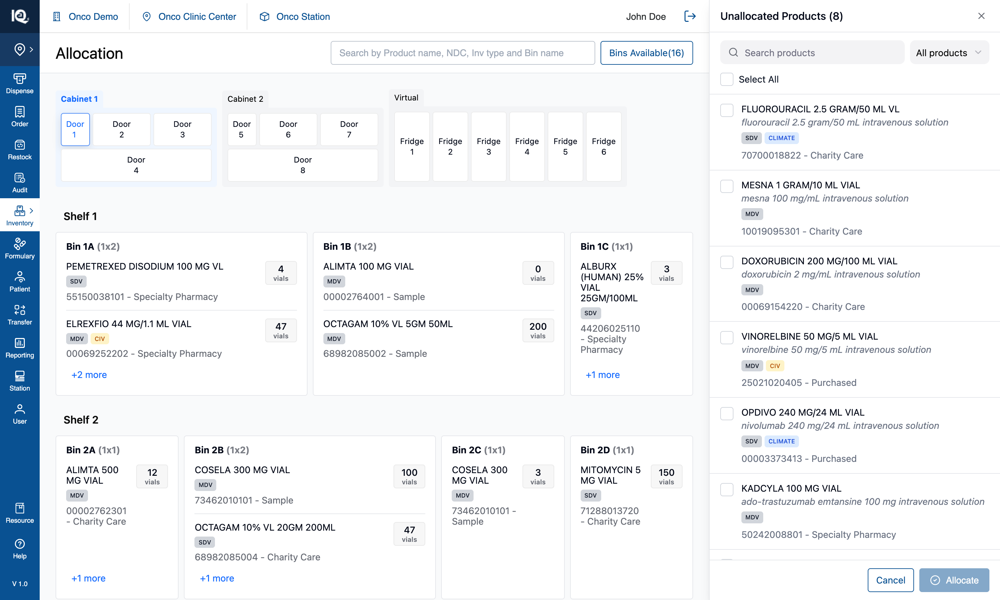
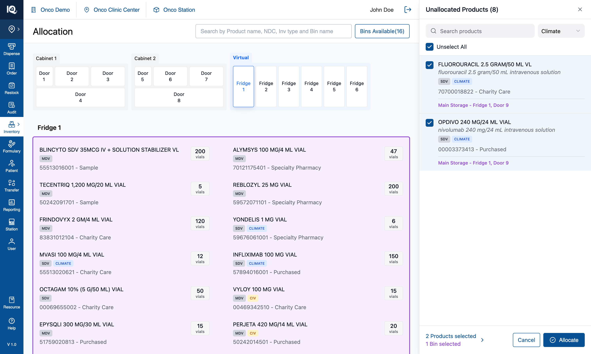

# 02 — Allocate Product

**Surface:** `Allocate/Move` › **Allocate Product** — the Unallocated Products tray (440px, right)
**Job:** give a bin to a product that has **no bin at all**
**Prototype files:** `UnallocatedProductsPanel.tsx`, `ProductListControls.tsx`, `useInventoryState.ts`, `utils/unallocatedFilter.ts`, `utils/badgeFilter.ts`
**Captured:** 2026-08-10 · seed data unmodified · screenshots at 1512×908

Read [00-Introduction.md](00-Introduction.md) first — this document assumes the cabinet model, the tap
rules and the identity triple described there.

**Available at both access levels.** Allocation decides where stock should live, which needs no hands on
the hardware, so this workflow is offered at clinic level too — see
[07-Station-Switcher.md](07-Station-Switcher.md).

---

## Default state {copy}

`Allocate/Move` › **Allocate Product** opens the Unallocated Products tray on the right, listing every
product in the catalogue that currently holds no bin — 8 in this seed. The title states that whole
count, and the cabinet stays live behind the panel, because the bins are picked on it rather than in
the panel.

From here the operator can search the tray by name, generic name, NDC or source; narrow it to
`Climate`, `CIV`, `SDV` or `MDV` with the badge filter; tick products individually or use `Select All`
to take everything currently listed; and tap bins on any door or fridge to choose where the ticked
products should go. `Allocate` stays disabled until **both** a product and a bin are chosen — the
footer says which half is missing. Tapping a bin before any product is ticked is refused with a message
naming the panel to pick in.

## Interaction state {copy}

The workflow this tray is built for, in three taps: filter to `Climate`, `Select All`, then tap a
fridge — climate-sensitive stock belongs in a fridge, so every product the filter finds shares one
destination, which is exactly when `Select All` is the right control.

Ticked rows are tinted, the filter trigger turns green while it is narrowing, and `Select All` becomes
`Unselect All` once everything listed is ticked. Each ticked product lists the bins it is about to be
assigned to in purple, and each chosen bin is outlined purple on the canvas — one colour for "picked
for assignment", in both places. The footer counts both halves, and tapping that counter switches the
list to just the ticked products so the operator can check what they hold without losing it.

Pressing `Allocate` writes the products into **every** chosen bin at once, removes them from the tray,
records the allocation in History, and clears the selection ready for the next round — the panel stays
open, because allocating one batch is rarely the whole job.

---

## 1. What the feature is

The tray is the module's most basic allocation job: **getting a product into the cabinet at all.** It
is the first entry in the workflow menu for that reason.

Its counterpart, [Multi Bin Assignment](03-Multi-Bin-Assignment.md), gives an *additional* bin to a
product that already has one. The two entries are the same sentence bar two words — "Assign bins to
unallocated products" / "Assign additional bins to allocated products" — and they share the bin-picking
channel, so a bin tap means the same thing in both.

---

## 2. Behaviour

### 2.1 What the tray holds

- Seeded once on mount: every catalogue product not already in a bin (8 in this seed).
- The title count — `Unallocated Products (8)` — is **the whole tray, never the filtered view**. It was
  briefly the filtered count, which made searching look like products had disappeared.
- Allocating removes those products from the tray. Nothing puts products back into it: unallocating a
  product elsewhere does **not** return it here (§5.1).

### 2.2 Narrowing the list

Three independent narrowings, composed as **AND**:

| Narrowing | Notes |
|---|---|
| Search | Plain substring over four fields: name, generic name, NDC, source. Not the header's query grammar — the tray holds eight products, so there is nothing to compose against. |
| Badge filter | `All products` (default), `Climate`, `CIV`, `SDV`, `MDV`. Single-select by design: `SDV`/`MDV` are two halves of one property, and a multi-select would have to decide whether `Climate + CIV` means both badges or either. |
| Review selection | The footer counter scopes the list to the ticked products. |

Rules that follow, and each of them has been a bug at some point:

- **`Select All` acts on exactly what is listed** — the same predicate the list renders from
  (`filterUnallocatedProducts`). A control labelled "all" must never tick a product the operator cannot
  see.
- **It completes a partial selection rather than clearing it**, and the label follows: `Select All`
  until everything listed is ticked, `Unselect All` after.
- **The badge filter survives a cleared search box.** Here the filter *produces* the list, so resetting
  it when the query empties would undo the narrowing at the moment it is doing the work. (Multi Bin does
  the opposite — see §2.2 of that document.)
- **The filter is cleared when the tray opens and when it closes**, unlike the search box: a stale
  `Climate` would make the tray look like it holds two products.
- **The selection is independent of both narrowings.** A ticked product that a later search hides stays
  ticked and still counts in the footer.

Three distinct empty states, checked in this order — the filter's first, because a filter set at the
top of the panel outlives whatever the operator does in the search box:

1. `No Climate products match that search.`
2. `No products match that search.`
3. `Nothing to allocate — every product already has a bin.`

### 2.3 Choosing bins

- A bin tap toggles it in or out of the selection, on **any** door or fridge, and doors can be switched
  freely mid-selection.
- Chosen bins are outlined purple (`#8F48D2`) on the canvas and listed in purple under every ticked
  product row.
- **A bin tap before any product is ticked is refused**, with a toast naming where to pick:
  *"Select a product in the Unallocated Products panel, then tap a bin on the left canvas."*
- **A bin already holding one of the ticked products is refused** — *"One of the selected products is
  already in that bin. Choose a different bin."* The whole bin is refused while **any** ticked product
  sits there, rather than silently dropping that one pairing at confirm.
- While the tray is open, product rows inside bin cards are **not** tappable: a tap has to mean the bin.

### 2.4 Allocating

`Allocate` is enabled only with at least one product and one bin. On confirm:

1. **Every ticked product is written into every chosen bin** — a 2 × 3 selection produces six rows. The
   pairing is a cross product, not a matching.
2. **Each new row opens at `quantity: 0`.** The allocation is the act; stock arrives later by moving it
   in. This is intended, and it is why repeatedly allocating during exploration accumulates 0-quantity
   rows.
3. **Rows are prepended, not appended.** A bin card shows only as many rows as its footprint fits and
   hides the rest behind `+N more`, so a product added to the end of a full bin would land straight in
   the hidden remainder — allocated, toasted, and invisible.
4. The bin's `available` flag flips to `false`, so `Bins Available(n)` drops accordingly.
5. The products are removed from the tray and the title count drops.
6. A `New Bin Allocation` entry is written to History, naming the products and the bins.
7. A toast lists the product names, and both selections are cleared. **The panel stays open** for the
   next round.

---

## 3. Implementation in the prototype

| Concern | Where |
|---|---|
| Tray contents | `generateUnallocatedProducts`, seeded into `unallocatedProducts` on mount |
| What is visible | `filterUnallocatedProducts` — `utils/unallocatedFilter.ts`, the single source for both the list and `Select All` |
| Badge rule | `utils/badgeFilter.ts`, shared with Multi Bin Assignment |
| Filter + Select All UI | `ProductListControls.tsx` (`BadgeFilterSelect`, `SelectAllToggle`), composed identically by both panels |
| Bin taps | `handleBinClick`'s `showUnallocatedProducts` branch → `selectedBinsForAssignment` |
| Confirm | `handleConfirmAssignment` in `useInventoryState.ts` |
| Panel | `UnallocatedProductsPanel.tsx` |

The tray's filter state and its review flag live in the **hook**, not the panel, because `Select All`
is a hook handler and has to tick exactly what the panel is listing. `node scripts/verify-unallocated-filter.mjs`
(101 assertions) pins that agreement, including that all three narrowings compose as AND in both
directions.

---

## 4. Data and persistence

In-memory only; a reload restores the original eight and discards every allocation. Two things a real
build has to supply that the prototype fakes:

- **What "unallocated" means.** Here it is "a catalogue product not currently in any bin", computed once
  at mount. A real system needs a defined source for this list and a rule for when a product enters it.
- **The opening quantity.** New rows open at 0 by design, so restocking is a separate act. If the real
  flow allocates *and* stocks in one step, that is a different workflow, not a parameter of this one.

---

## 5. Notes and open questions

### 5.1 Nothing ever returns a product to the tray

The tray is seeded once. Unallocating a product from the product detail page removes it from its bin but
does **not** put it back here, so it becomes reachable only by searching the catalogue in Multi Bin
Assignment. Whether unallocating should return a product to the tray is an open product question — the
prototype's answer looks more like an oversight than a decision.

### 5.2 History records an invented quantity

The bin rows open at 0, but the History entry this workflow writes fabricates a starting quantity per
product (10 for SDV, 5 otherwise, plus a random 0–4) and divides it across the chosen bins. History
renders no quantity line for an allocation, so the figure is invisible today — but it is wrong in the
record, and any report built on that data would inherit it. The sibling workflow deliberately does not
do this. **Do not port this behaviour.**

### 5.3 The cross product is not stated anywhere on screen

Two products and three bins produce six rows, and nothing in the panel says so before `Allocate` is
pressed — the footer counts "2 Products selected / 3 Bins selected", which reads equally like a pairing.
Worth a confirmation summary in a real build, particularly since there is no undo beyond unallocating
each row individually.

### 5.4 A hidden selection is only findable on demand

A ticked product that a later search or filter hides stays ticked and still counts in the footer. The
footer counter reveals it, and the empty states name whichever narrowing is hiding things — but nothing
*announces* the moment a pick becomes hidden.

### 5.5 Test assertions worth writing

1. `Select All` ticks exactly the products the list renders, under every combination of search and badge
   filter.
2. Allocating N products into M bins produces N × M rows, each at quantity 0, and removes N products
   from the tray.
3. Every affected bin's `available` becomes false, and `Bins Available(n)` drops by the number of bins
   that were previously empty.
4. A bin already holding a ticked product is refused, and no partial allocation is written.
5. Conservation: for every product identity, total quantity across all bins is unchanged by an allocation
   (all new rows are 0).
6. The tray's title count always equals the unfiltered tray length, whatever the search and filter say.
