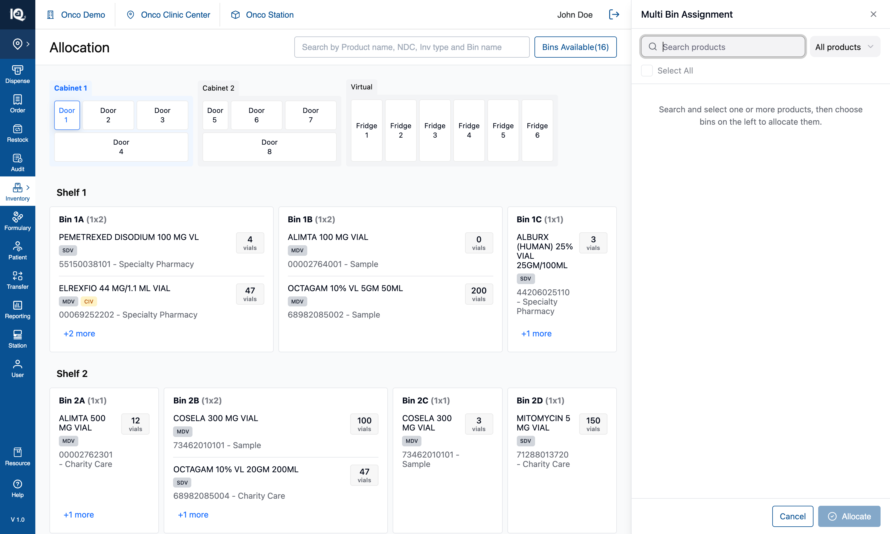
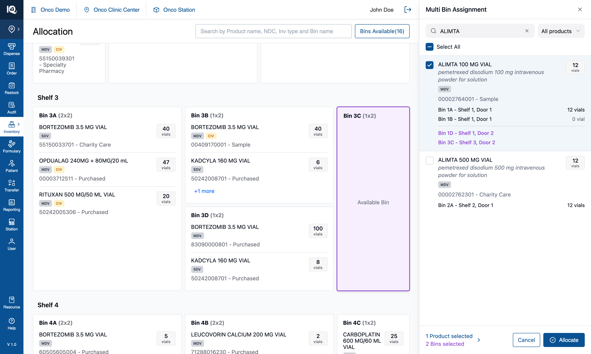

# 03 — Multi Bin Assignment

**Surface:** `Allocate/Move` › **Multi Bin Assignment** — a 440px panel on the right
**Job:** give an **additional** bin to a product that already has one
**Prototype files:** `AllocateProductsPanel.tsx`, `ProductListControls.tsx`, `useInventoryState.ts`, `utils/badgeFilter.ts`
**Captured:** 2026-08-10 · seed data unmodified · screenshots at 1512×908

Read [00-Introduction.md](00-Introduction.md) first, and [02-Allocate-Product.md](02-Allocate-Product.md)
alongside this one — the two are deliberately the same panel design doing two different jobs.

**Available at both access levels**, for the same reason as the tray — see
[07-Station-Switcher.md](07-Station-Switcher.md).

---

## Default state {copy}

`Allocate/Move` › **Multi Bin Assignment** opens a panel that lists **nothing**, with the cursor already
in its search box. That is the workflow, not a loading state: this panel searches the whole stocked
catalogue, so listing it unprompted would be a few hundred rows to scroll. One line of guidance says
what to do — *"Search and select one or more products, then choose bins on the left to allocate them."*

From here the operator searches for a product already in the cabinet, ticks it, and taps the bins that
should also hold it. `Allocate` stays disabled until both halves are chosen. Tapping a bin before
ticking a product is refused with a message naming this panel and its search box.

## Interaction state {copy}

Searching `ALIMTA` returns the matching products; ticking one tints its row and — the point of this
workflow — **lists the bins it already occupies, with the quantity in each**: `Bin 1A - Shelf 1, Door 1`
at 12 vials, `Bin 1B - Shelf 1, Door 1` at 0. That context is what tells the operator which bin to add
and stops them picking one the product is already in.

Below it, in purple, are the bins just chosen on the canvas — `Bin 1D - Shelf 1, Door 2` and
`Bin 3C - Shelf 3, Door 2` — each also outlined purple on the shelves. The footer counts both halves,
and tapping that counter clears the search to show the ticked products on their own, so a selection
built across several searches can be checked without retyping any of them.

Pressing `Allocate` adds the product to both chosen bins at `quantity: 0`, records a
`New Bin Allocation` in History, and clears the selection with the panel still open.

---

## 1. What the feature is

The specialised half of allocation: **a product that is already stocked somewhere gains another
location.** The tray ([02](02-Allocate-Product.md)) is for products with no bin at all.

The distinction is worth holding onto because the two share their bin-picking channel and their panel
design, and are easy to conflate. The menu entries are one word apart on purpose:

| Entry | Reaches |
|---|---|
| **Allocate Product** — "Assign bins to **unallocated** products." | The tray |
| **Multi Bin Assignment** — "Assign **additional** bins to **allocated** products." | This panel |

---

## 2. Behaviour

### 2.1 The list is search-first

- **Nothing is listed until something is typed.** The panel searches every product in the cabinet, and
  listing that unprompted is the catalogue-to-scroll this panel was built to avoid.
- **The search box is focused on open**, since searching is the only way in.
- Results are the header search's matcher over the stocked catalogue, so name, NDC, source, inventory
  type and generic name all match, and the query grammar (whitespace or comma separated terms, ANDed)
  applies.
- Each row states the product's badges and **every bin it currently occupies, with quantities.**

### 2.2 The badge filter refines, it does not produce

Same control as the tray's, one behaviour different:

- **With no query the list stays empty whatever the filter says.** Letting `Climate` alone list every
  climate-sensitive product would reinstate exactly the long scroll this panel avoids.
- It is still useful before typing, as a pre-set: choose `Climate`, then search, and only
  climate-sensitive matches come back.
- **Clearing the search box drops the filter with it** — via the `X`, the footer counter, or backspacing
  to empty. The opposite of the tray, where the filter produces the list and must survive.

### 2.3 The selection

- **Multi-select survives re-searching.** The panel holds the picked product *objects*, not their keys,
  so a product found under one query is not lost when the query changes.
- **With the box clear, the panel lists the selection** under a `Selected products` header, in the same
  row component, always ticked — so a tap there can only remove.
- **Newest pick first** in that list: appending put the row that just changed at the bottom, off screen
  as soon as the selection outgrew the panel.
- **While a search is running the selection is not shown separately.** A "no products match" message
  followed by a list of products that plainly do not match reads as a contradiction. A selected product
  that *does* match appears in the results, already ticked.
- `Select All` acts on whatever is listed — the results, or the selection when the box is clear — and is
  correctly dead when a query matches nothing.

### 2.4 Choosing bins

- A bin tap toggles it, on any door or fridge, and the chosen bins appear purple both on the canvas and
  under each ticked product.
- **A bin tap before any product is ticked is refused**: *"Search for a product in the Multi Bin
  Assignment panel, then tap a bin on the left canvas."* The panel's search box takes focus with it.
- **A bin that already holds a ticked product is refused on tap**, and skipped again at confirm — see
  §2.5.
- Product rows inside bin cards are inert while this panel is open: a tap has to mean the bin.

### 2.5 Allocating

`Allocate` requires at least one product and one bin. On confirm:

1. **The plan is computed once, before the state update**, and both the cabinet write and the History
   entry are built from that same plan — so the ledger cannot claim an allocation that did not happen.
2. **A (product, bin) pair is skipped where that bin already holds the product's identity.** The skip is
   per product, not per bin: allocating two products to one bin that already stocks one of them writes
   the other. Adding it twice would split one product into two rows in one bin and every count in the
   app would double it.
3. **Each new location opens at `quantity: 0`.** Stock arrives by moving it in — that is the Move
   workflow's job, not this one.
4. Rows are **prepended**, so a new location is visible rather than landing behind `+N more`.
5. The bin's `available` flag flips to `false`, so `Bins Available(n)` drops accordingly.
6. A `New Bin Allocation` entry is written to History, carrying **per-product target bins** — a shared
   bin list would credit every product with every bin and report allocations that never happened.
7. The selection clears, the panel stays open.

**No invented quantities.** The entry deliberately records no starting stock, because the new location
genuinely opens at zero. The tray's confirm handler does fabricate one; that is a defect, not a pattern
to copy ([02](02-Allocate-Product.md) §5.2).

---

## 3. Implementation in the prototype

| Concern | Where |
|---|---|
| Panel and its selection | `AllocateProductsPanel.tsx` — search, badge filter, `Select All`, selected-products view |
| Badge rule | `utils/badgeFilter.ts`, shared with the tray |
| Filter + Select All UI | `ProductListControls.tsx`, composed identically by both panels |
| Bin taps | `handleBinClick`'s `showAllocateProducts` branch → `selectedBinsForAssignment` |
| Confirm | `handleAssignProductsToBins` in `useInventoryState.ts` |

This panel keeps its filter and selection in its own `useState`, unlike the tray, because both halves
live in this component and there is no boundary to agree across.

---

## 4. Data and persistence

In-memory only; a reload discards every assignment. For a real build, the load-bearing decision is what
a "location" is: this workflow creates a **bin-level allocation with no stock**, which the system must
be able to represent — a product row that exists at quantity 0 and still occupies its bin. If
allocations and stock are the same record in the backend, this workflow has nothing to write.

---

## 5. Notes and open questions

### 5.1 Two guards for one rule

A conflicting (product, bin) pair is refused twice: on the bin tap, and again when the plan is built at
confirm. That is deliberate — the entry is built per product rather than resting on the UI check staying
exhaustive — but it means the confirm-time skip is normally unreachable, so a bug there would be
invisible in ordinary use.

### 5.2 A hidden selection is only findable on demand

As in the tray: a ticked product that a later search hides stays ticked and still counts in the footer.
The footer counter is the way back to it. Nothing announces the moment a pick becomes hidden.

### 5.3 Nothing states how many rows will be written

The footer counts products and bins, but the cross product minus the skips is not shown before
`Allocate`. Two products across three bins where one bin already stocks one of them writes five rows,
not six, and the operator learns that only from the cabinet afterwards.

### 5.4 Test assertions worth writing

1. With no query, the list is empty regardless of badge filter; with a query, the filter narrows the
   results.
2. Clearing the search box resets the badge filter, by every route that can clear it.
3. A product picked under one query survives a different query and remains in the footer count.
4. Allocating writes exactly one row per (product, bin) pair that does not already exist, each at
   quantity 0, and skips the rest.
5. The History entry's per-product target bins match the pairs actually written — never the full bin
   list.
6. Conservation: total quantity per product identity is unchanged by an assignment.
