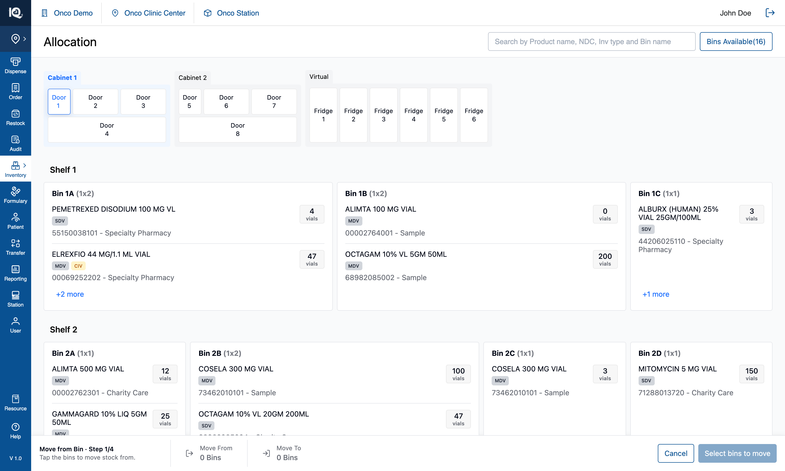
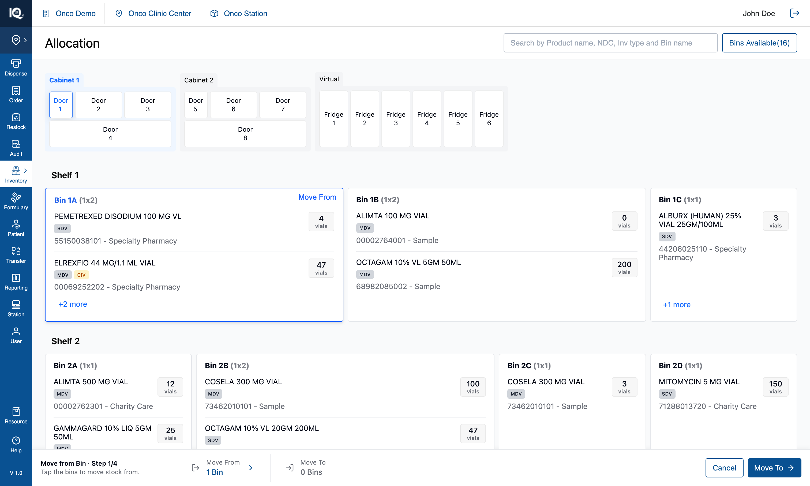
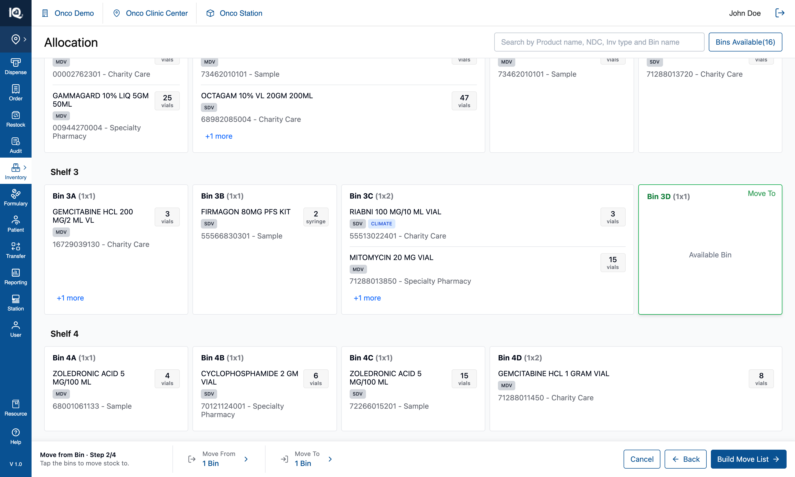
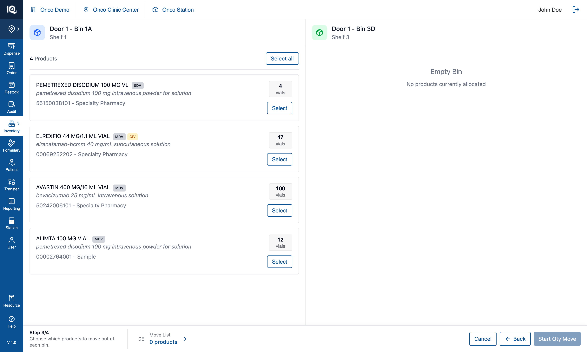
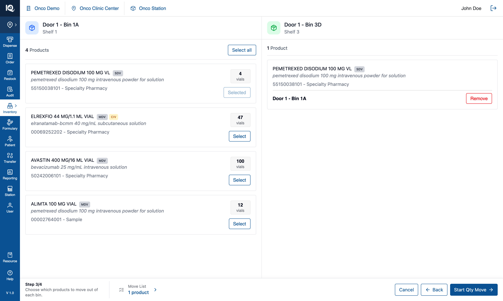
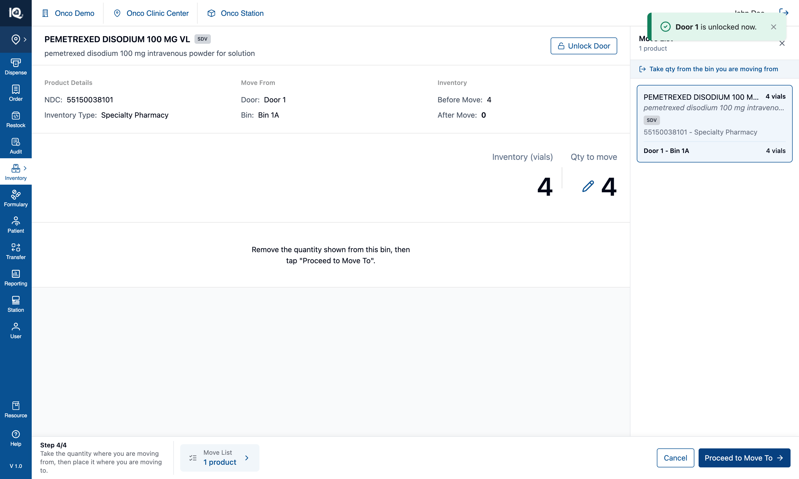
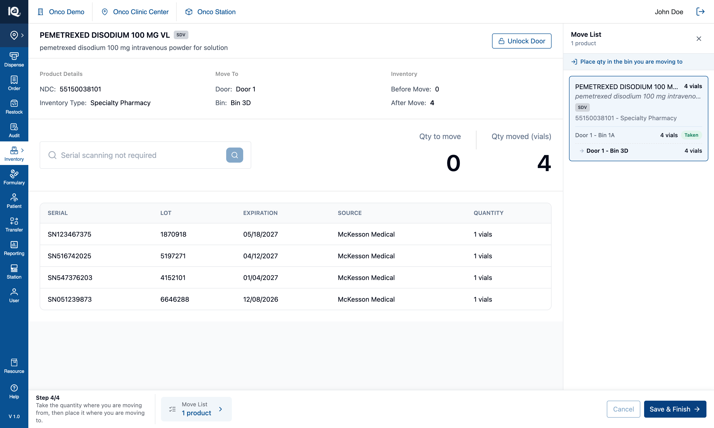
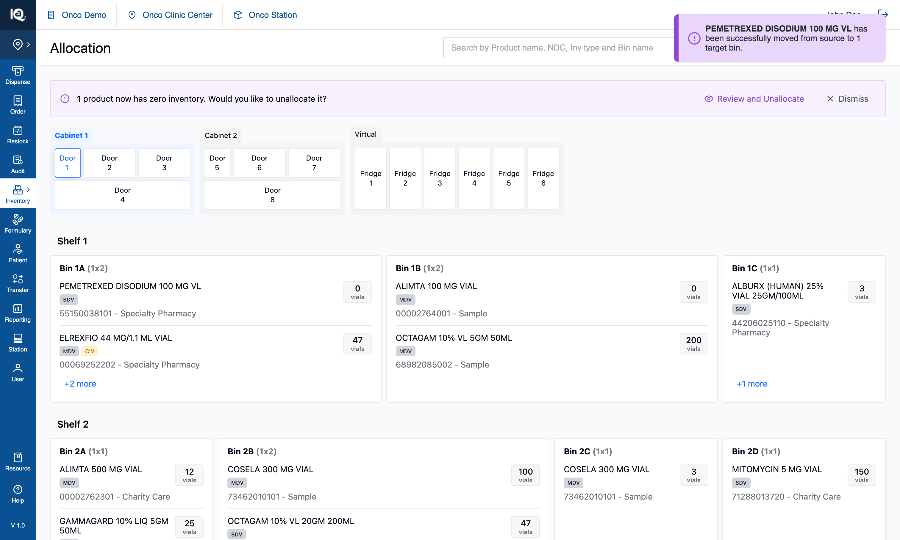

# 04 — Move from Bin

**Surface:** `Allocate/Move` › **Move from Bin** — a four-step, full-page pipeline
**Job:** move stock out of one or more bins into one or more other bins
**Prototype files:** `PipelineSteps.tsx`, `PipelineFooter.tsx`, `ChangeAllocationModal.tsx`, `QuantitySelectionPage.tsx`, `TargetBinSerialScanPage.tsx`, `MoveSummaryPanel.tsx`, `useInventoryState.ts`
**Captured:** 2026-08-10 · seed data unmodified · screenshots at 1512×908

Read [00-Introduction.md](00-Introduction.md) first. [05-Move-from-Product.md](05-Move-from-Product.md)
is the same pipeline entered through the other door — only step ① differs, so that document covers step
① and refers back here for the rest.

---

## The shape of the pipeline

Four steps, each a **full page**, all carrying the same footer:

```
① Bin        the cabinet page      — pick the bins to move from
    ↓  Move To →
② Target     the same page, step 2 — pick the bins to move to
    ↓  Build Move List →
③ Review     one card per source bin — choose which products leave each
    ↓  Start Qty Move →
④ Move       take the quantity at each source  (QuantitySelectionPage)
             place it in the target, scanning if required  (TargetBinSerialScanPage)
    ↓  Save & Finish → the move commits
```

Three things about that shape are deliberate:

- **Step ① is named for the unit** — `Bin` here, `Product` in the other kind. The operator chose the
  unit in the menu, so the step carrying it out says the same word back.
- **Step ④ spans two screens and stays `Step 4/4` across both.** Taking stock at the source and placing
  it in the target are two halves of one errand; a separate "Place" step misrepresented them as two.
- **Review is a page, not a modal.** It was a dialog, which read as a different kind of surface from the
  pages either side of it.

---

## Step ① — pick the bins to move from {copy}



The cabinet stays exactly as it is in View Mode, with a footer added: `Move from Bin · Step 1/4` and the
instruction *"Tap the bins to move stock from."* The two summary cells read `Move From 0 Bins` and
`Move To 0 Bins`, and the primary states its own requirement — **`Select bins to move`** — rather than
greying out silently.

From here the operator taps any stocked bin on any door. Tapping toggles, doors can be switched freely,
and the header search still works for locating a bin by name. Product rows inside the cards are inert:
in this kind of move the bin is the unit.



A picked bin takes a blue outline and a **`Move From`** badge, the summary cell becomes `1 Bin` in blue
with a chevron — tap it to open a panel listing what is selected — and the primary becomes **`Move To →`**.
Picking a bin does **not** commit its contents; which of its products actually leave is asked at step ③.

## Step ② — pick the bins to move to {copy}



The instruction changes to *"Tap the bins to move stock to."* and the primary again states its
requirement — `Select Bin to move` — until a bin is picked, then becomes **`Build Move List`**. A `Back`
button appears beside `Cancel`.

Target bins take a green outline and a **`Move To`** badge. A bin already chosen as a source is refused
with an explanation — *"This bin is one you are moving from, so it cannot also be moved to. Pick a
different bin."* — because stock would otherwise leave and arrive in the same place. An empty bin is a
perfectly good target: that is what the availability filter is for, and it stays usable here
([01-Bins-Available.md](01-Bins-Available.md) §2.5).

The primary is `Build Move List`, not "Review", because the list is still being assembled — step ③ is
where the operator says which products leave.

## Step ③ — choose which products leave each bin {copy}



A page of cards, one per source bin, each listing that bin's products with a **`Select`** button. The
footer drops the workflow prefix — by now the two kinds of move have converged — and reads
`Step 3/4 · Choose which products to move out of each bin.` The primary is **`Start Qty Move`**, and the
`Move List` cell beside it counts `0 products` until something is chosen.



`Select` becomes `Remove`, the footer counts `1 product`, and the Move List panel can be opened to see
what is moving where. The right-hand column of each card separates **arrivals** — what this move puts
in — from **what the bin already holds**, as two sections with their own counts, because a bin can
already stock the product being moved into it.

Nothing has changed in the cabinet yet. `Cancel` is still available and still costs nothing.

## Step ④ — take the quantity, then place it {copy}



The **take** half, one product at a time: the product's name and badges, `Move From` door and bin, the
bin's inventory `Before Move` and `After Move`, and the quantity to move — editable via the pencil,
defaulting to everything in the bin. The instruction is explicit about the physical act: *"Remove the
quantity shown from this bin, then tap 'Proceed to Move To'."*

Two controls exist for the cabinet itself: **`Unlock Door`** beside the product name, which re-sends the
unlock when the app believes it sent one and the hardware did not, and `Cancel`, which is available
**only until the first quantity leaves a source bin**.

The **Move List** panel on the right is the answer to "what am I carrying": sources listed, then
targets, each stated once, with the collected total beside the product name and a `Taken` badge once
that source is done.



The **place** half, same step number: `Move To` door and bin, the target's `Before`/`After`, a serial
scan box — here reading *"Serial scanning not required"* — and `Qty moved`. The items being placed are
listed with serial, lot, expiry and source.

Note the footer: **`Cancel` is now dimmed.** Every quantity has been taken by this point, so cancelling
would rest entirely on the operator putting stock back in the right bins, which nothing in the app can
verify. Tapping it explains rather than doing nothing. The primary is **`Save & Finish`**, and that is
the first control in the whole pipeline that changes inventory.



On commit the transfers are applied, the pipeline closes, and the operator is returned to the cabinet with
a toast confirming what moved where. The source row is now at **0 vials** — visible on Bin 1A above — and
because this move took everything out of it, the **zero-inventory banner** is raised over the cabinet:
*"1 product now has zero inventory. Would you like to unallocate it?"*, offering `Review and Unallocate`
or `Dismiss`.

That banner is deliberately a banner and not a modal. It used to open a dialog the instant a move
committed, interrupting the operator at the one moment they had just finished something, to ask a question
with no deadline: a product at 0 still holds its bin and can be unallocated whenever. **Dismissing is a
real answer** and clears the prompt rather than deferring it. The unallocation it offers is the same act
the product detail page provides ([00 §Product details](00-Introduction.md)).

A `Product moved` entry is written to History ([06-History.md](06-History.md)). Note the post-move scan
behind the banner walks **every** transfer's source bin, not just the ones that carried quantity, because a
whole batch can legitimately move nothing but the allocation.

---

## 1. Behaviour that spans the pipeline

### 1.1 The footer is the pipeline's only chrome

```
[ Step n/4 + instruction ] │ [ summary cell ] [ summary cell ]     [ Cancel ] [ Back ] [ primary → ]
```

- The step cell is a fixed **240px**, so a longer instruction on one step does not shunt everything to
  its right sideways on the next.
- **Steps ① and ② prefix the workflow** (`Move from Bin · Step 1/4`); steps ③ and ④ drop it, because by
  then the two kinds have converged onto the same screens with the same rules.
- Summary cells go **blue with a chevron** the moment they hold something, and open a panel listing the
  selection. A zero is counted in the mode's own unit.
- **A disabled primary states its requirement** in its own label. The exception is `Cancel`, whose label
  is its identity — it keeps the word and explains via a toast when unavailable.
- `Cancel` and `Back` are blue secondary buttons, not red: leaving a flow discards a selection that was
  never committed, which is a step back rather than a deletion.

### 1.2 Quantities are taken at every source before anything is carried

The quantity page walks **every** product itself and hands the whole move over once. It used to report
one product at a time, so four products meant four round trips over the same two doors.

Both screens walk in the **route's** order, not the order the transfers were created: the route is
planned once so that a move whose sources sit behind two doors never sends the operator back to a door
they had finished with. The page advances **one stop at a time** — the next group not skipped — because
a product with bins behind two doors has other products' bins between its own.

### 1.3 The quantity taken is not divided between targets

Each transfer out of one source carries that source's **whole** amount, and the placement screen assigns
the real shares as the operator scans into each bin. Anything reading a transfer's quantity as "the
amount for this one target" is wrong.

### 1.4 There is no Back inside step ④

Both step-④ screens had one and both were removed at the operator's request, along with the resume
machinery that existed to serve them. `Cancel` is the only exit and it discards the move; there is no
route back to Review without losing the selection.

### 1.5 A move can carry no stock at all

A product sitting at `quantity: 0` can be moved: what moves is the **allocation** — the source loses the
product record, the target gains it. The quantity page says *"This bin has no quantity to remove — the
allocation will still move"* and hides the editor. History classifies on the action, not on the quantity,
so this is still filed as a move rather than as a new allocation.

---

## 2. Implementation in the prototype

| Concern | Where |
|---|---|
| Step vocabulary and instructions | `PipelineSteps.tsx` — `TOTAL_PIPELINE_STEPS`, `instructionFor`, `workflowLabel`, `binTapRefusal` |
| Footer parts | `PipelineFooter.tsx` — `PipelineFooterShell`, `StepCell`, `SummaryCell`, `FooterButton` |
| Steps ① and ② | the cabinet page, via `handleBinClick`'s `changeAllocationMode` branches |
| Step ③ | `ChangeAllocationModal.tsx` (a page despite the name), `SourceProductCard`, `TargetProductCard` |
| Step ④ | `QuantitySelectionPage.tsx`, then `TargetBinSerialScanPage.tsx` |
| Route planning | `planMoveRoute` + `twoPhaseWalkOrder`, planned in `App` and handed to both screens |
| Move List panel | `MoveSummaryPanel.tsx` — presentational; each screen derives its own rows |
| Commit | `handleConfirmChangeAllocation` |

`node scripts/verify-quantity-walk.mjs` (15 assertions) pins the walk, including a skip whose product
has bins further along. `node scripts/verify-move-route.mjs` and `verify-step4-walk.mjs` cover the route.

The transfer record is `{ productId, fromBinId, toBinId, quantity, actionType, serialNumbers }`, staged
at `quantity: 0` with `actionType: 'move'`; the real amount is set on the quantity page.

---

## 3. Notes and open questions

### 3.1 Step ④'s take-then-place shape is specified to change

The current fixed shape — take everything, then place everything — is documented for replacement by a
cabinet-aware route under a one-door-at-a-time constraint. `STEP4-GUIDANCE.md` in the repo root is that
specification; **none of it is built.** Anyone implementing step ④ should read it before treating the
present behaviour as the target.

### 3.2 Serial numbers are counted, not validated

The scan box accepts serials and checks only that enough have been provided. No serial value is compared
against anything, despite the UI implying otherwise.

### 3.3 Two position counters are switched off, not decided

`Product n of N` and `Source/Target Bin n of N` are behind a flag, hidden at the operator's request while
the Move List panel is judged on its own. The cells and their side sheets stay wired. If the answer is
"off", they should be deleted rather than left behind a flag.

### 3.4 The `+N more` panel does not close when the step changes

Open it in step ① and it stays open through step ②, where its rows mean nothing.

### 3.5 One instruction serves both step-④ screens

`instructionFor` returns the same "take, then place" sentence on the take screen and the place screen.
Each screen's own header disambiguates, so this is tolerable rather than right.

### 3.6 Test assertions worth writing

1. **Conservation:** for every product identity, total quantity across all bins is unchanged by a
   committed move.
2. A bin chosen as a source cannot be chosen as a target, and the refusal explains why.
3. Review offers, for each source bin, only the products actually picked for that bin.
4. The quantity page visits every non-skipped stop exactly once, in route order, and never leapfrogs.
5. `Cancel` is available at every stage up to the first taken quantity and unavailable after it.
6. A move that empties a source bin leaves the product row at 0 and the bin **not** available until it is
   unallocated.
7. A move of a 0-quantity product relocates the allocation and is filed as a move, not an allocation.
