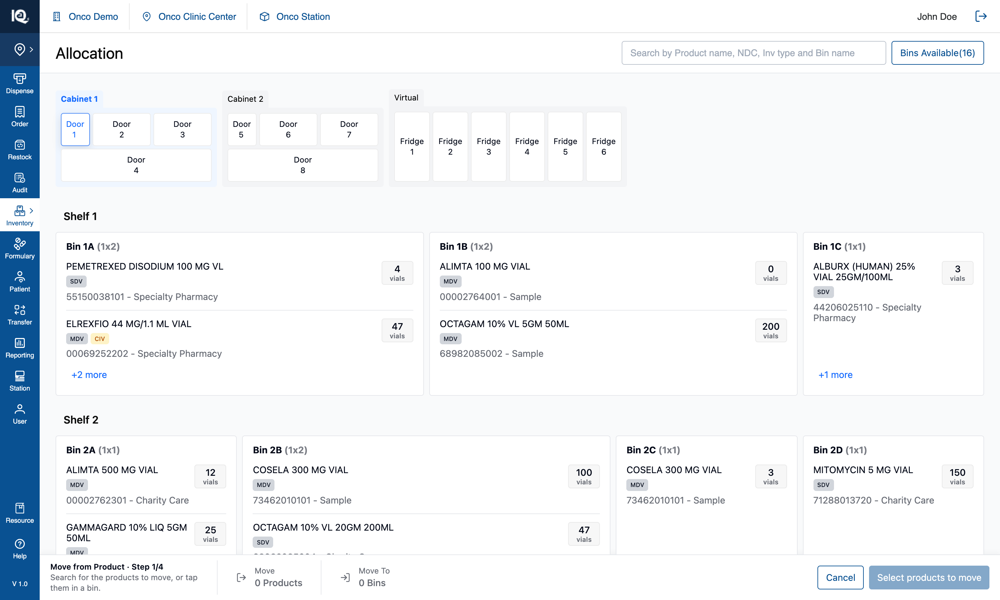
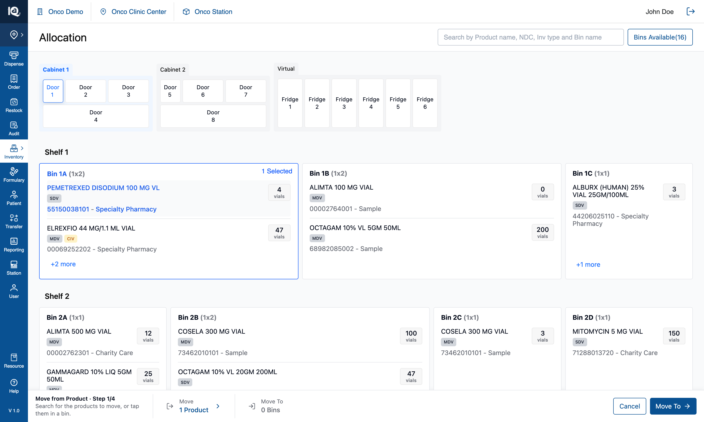

# 05 — Move from Product

**Surface:** `Allocate/Move` › **Move from Product** — the same four-step pipeline, entered differently
**Job:** move a **product** out of wherever it lives into one or more other bins
**Prototype files:** `PipelineSteps.tsx`, `BinCard.tsx`, `AllProductsPanel.tsx`, `utils/sourcePicks.ts`, `useInventoryState.ts`
**Captured:** 2026-08-10 · seed data unmodified · screenshots at 1512×908

**This is not a second workflow.** It is [04 — Move from Bin](04-Move-from-Bin.md) entered through the
other door: step ① gathers a different unit, and from step ② onwards the screens, rules and commit are
identical. Read 04 for steps ②–④; this document covers what differs, which is all in step ①.

**Station level only**, like the other kind — see [07-Station-Switcher.md](07-Station-Switcher.md).

---

## Step ① — pick the products to move {copy}

The footer reads `Move from Product · Step 1/4` with a different instruction — *"Search for the products
to move, or tap them in a bin."* — and the summary cells differ from the other kind in a way that is
easy to miss: the from-end is labelled just **`Move`**, not `Move From`, and it counts **`0 Products`**
rather than bins. The primary states **`Select products to move`**.

`Move From` names a *place*, and in this kind nothing was chosen from anywhere: the operator picks
products, and the bins join as a consequence. `Move From · 1 Product` asked from where and then did not
answer.

From here there are two routes in, and **the bin card itself is inert**:

| Gesture | Result |
|---|---|
| Tap a **product row** on a bin card | Picks that product **in that bin** — one pair |
| Pick a product from the **header search** dropdown | Picks it in **every** bin it lives in — "wherever this drug is" |
| Tap the **bin card** | Refused, with a toast: *"This move goes by product — tap a product inside the bin, or search for it."* |

The picked row turns blue — the operator chose *this product*, so the product is what is marked — and the
bin card's badge reads **`1 Selected`** rather than `Move From`, counting that bin's products in the move.
The footer's from-end becomes `Move 1 Product` and the primary becomes `Move To →`.

Tapping a picked product again un-picks it. If that leaves its bin holding nothing that is still being
moved, the bin drops out of the selection on its own.

From step ② the two kinds converge completely: pick target bins, build the move list, choose per-bin
products at Review, then take and place. See [04](04-Move-from-Bin.md).

---

## 1. Why the unit is declared up front

The menu asks which kind of move this is, and the answer is carried in state for the whole pipeline
rather than inferred from the selection.

Review used to **guess** the perspective from the data — it built a product-centric list only when the
selection spanned more than some number of bins — so a product living in two bins got the bin-centric
screen and the operator found themselves picking bins when they had come to move a product. Intent is not
recoverable from a selection, so it is asked for and carried.

That one flag decides how the source is gathered, what step ①'s label says, which instruction the footer
prints, what unit an empty summary counts in, and how Review reads. **Any new branch on "what kind of move
is this" belongs there, not in a heuristic over the data.**

---

## 2. The selection is (bin, product) pairs

A Move from Product's selection is a set of **(bin, product)** pairs, not a list of product identities.
The distinction is load-bearing and every bug in this area came from collapsing it:

- **Breadth comes from the gesture, never from matching.** A row tap is one pair; a search pick is one
  pair per bin that product occupies.
- A product picked in Bin 1B must not become picked in Bin 1C merely because Bin 1C also holds it, and a
  second product sitting in a bin that joined the selection must not be dragged in with it.
- A bin card counts **its own** picks, so the badge and the footer cannot disagree.
- A row's highlight comes from the picks, not from the search box: an unpicked row gets no highlight, and
  a picked row stays highlighted after the search is cleared.
- Review scopes each bin's list to that bin's picks, so a bin never offers a product picked somewhere
  else.

`node scripts/verify-source-picks.mjs` (16 assertions) pins this.

---

## 3. Where a product row means three different things

The same row is a link, a selection, or nothing, depending on where the operator is — and every surface
that renders one has to handle all three:

| Where | A product row does |
|---|---|
| View Mode | Opens the product's detail page |
| Move from Product, step ① | Selects that product, in that bin |
| Move from Bin, or either assignment panel, or step ② | Nothing — the scope is the bin |

"Nothing" is not the same as "no handler": on a bin card the tap bubbles to the card and selects the
**bin**, which is correct in a Bin move and at either kind's target step. In the `+N more` panel there is
no card beneath, so the tap is swallowed — and that is the one genuinely dead product row in the app,
which is why it raises an explaining toast instead.

---

## 4. Notes and open questions

### 4.1 The refusal toasts are the only thing standing between a rule and a dead control

Three taps are legitimately refused in this kind of move — the bin card in step ①, a product row in the
`+N more` panel, and a source bin at step ② — and all three used to be refused in silence. The copy lives
beside the footer's instructions so a correction and the standing advice cannot drift into contradicting
each other, and all three share one toast id so a repeated tap replaces the message rather than stacking
copies.

### 4.2 Search picks can be broader than they look

Choosing a product from the dropdown picks it in **every** bin it occupies. That is what "wherever this
drug is" means and it is deliberate, but the breadth is only visible afterwards, in the badges on each
affected bin and in the footer's count.

### 4.3 Everything in [04 §3](04-Move-from-Bin.md) applies here too

Step ④'s shape is specified to change, serials are counted rather than validated, the position counters
are switched off rather than decided, and the `+N more` panel does not close when the step changes.

### 4.4 Test assertions worth writing

1. A bin tap in step ① changes nothing and raises the explaining toast.
2. A row tap picks exactly one (bin, product) pair; a search pick picks one pair per bin holding that
   product.
3. Picking a product in one bin does not mark the same product in another bin, and does not mark other
   products in the same bin.
4. Un-picking the last picked product in a bin removes that bin from the selection.
5. Each bin's badge count equals that bin's own picks, and the footer's product count equals the distinct
   products picked.
6. From step ② onwards, a Move from Product and a Move from Bin with equivalent selections produce
   identical transfers.
