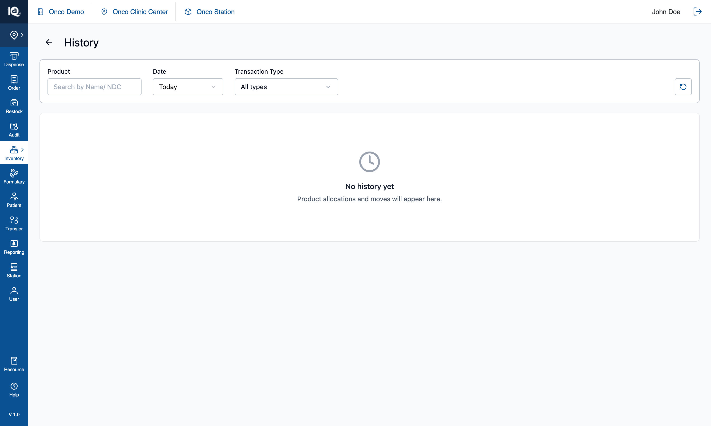
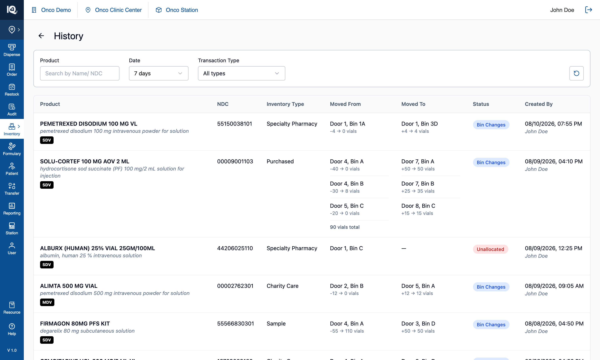

# 06 — History

**Surface:** the clock button in the header → a full page
**Job:** the ledger — every allocation, move and unallocation, with what changed and where
**Prototype files:** `HistoryPage.tsx`, `utils/historyUtils.ts`, `data/seedHistory.ts`, `useInventoryState.ts`
**Captured:** 2026-08-10 · seed data unmodified · screenshots at 1512×908

Read [00-Introduction.md](00-Introduction.md) first. This page is where the three write workflows —
[Allocate Product](02-Allocate-Product.md), [Multi Bin Assignment](03-Multi-Bin-Assignment.md) and the two
[move](04-Move-from-Bin.md) [kinds](05-Move-from-Product.md) — end up.

---

## Default state {copy}

The clock button in the header opens History as a full page: a filter row — `Product` search, `Date`, and
`Transaction Type` — over a table, with `Back` returning to the cabinet.

**The `Date` filter defaults to `Today`, and it opens empty in a fresh session**, showing
*"No history yet — product allocations and moves will appear here."* The seeded ledger is 1–6 days old, so
none of it passes the default filter. This is a real trap rather than a quirk: the message states there is
no history when there are fifteen entries one option away (§4.1).

From here the operator can search by product name or NDC, widen the date to 7, 15 or 30 days, narrow to
one or more transaction types, or reset the filters with the control at the end of the row.

## Interaction state {copy}

Widening `Date` to `7 days` shows the ledger. One row per product per transaction, newest first, with
seven columns: **Product** (name, generic name, vial badge), **NDC**, **Inventory Type**,
**Moved From**, **Moved To**, **Status**, and **Created By** (timestamp above the user).

The two location columns are where the value is. Each lists one line per bin, with the arithmetic beneath:
`-4 → 0 vials` on the source side, `+4 → 4 vials` on the target — what left, what the bin was left
holding, what arrived, what the bin ended up with. A transaction spanning several bins lists them all and
adds a **`90 vials total`** line, which a single-bin row omits because `-25 → 0` already says it.

**At clinic level the table carries one more column — `Station` — and the filter row one more control.**
A clinic reads several stations' ledgers in one table, so where a transaction happened is both a column
(ahead of the two bin columns, which say where *within* it) and a filter. Neither renders at station level.
See [07-Station-Switcher.md](07-Station-Switcher.md) §3.

`Status` is a chip, and it is what tells the three kinds apart:

| Chip | Colour | Written by |
|---|---|---|
| `Bin Changes` | blue | a completed move, either kind |
| `Bin Allocation` | green | Allocate Product, or Multi Bin Assignment |
| `Unallocated` | red | releasing a bin from the product detail page or the zero-inventory banner |

An unallocation shows a source bin and an em dash for the target: nothing arrived anywhere.

---

## 1. What gets written, and by which workflow

| Workflow | `transactionType` | Carries |
|---|---|---|
| [Allocate Product](02-Allocate-Product.md) | `New Bin Allocation` | The products and the bins they went into |
| [Multi Bin Assignment](03-Multi-Bin-Assignment.md) | `New Bin Allocation` | Per-product target bins — never a shared bin list |
| [Move from Bin / Product](04-Move-from-Bin.md) | `Product moved` | Per-bin quantities on both ends |
| Unallocate | `Unallocated` | The source bin only |

Every entry also carries the **station** it was written at, stamped at write time. An entry without one —
written before stations existed — renders an em dash rather than being assumed to belong to whichever
station is current.

Two rules behind that table:

- **Classification is on the action, not on the quantity.** A move that carries no stock — relocating an
  allocation at 0 — is still a move. Those were the same test while a 0-quantity transfer could only mean
  "allocate only", and a real move can now end at 0.
- **An allocation records no quantity line**, because a new location opens at zero. One workflow
  nonetheless writes an invented figure into its entry; see [02 §5.2](02-Allocate-Product.md) — the field
  is not rendered, so it is invisible rather than visible and wrong, but it is still wrong in the record.

---

## 2. Filtering

| Control | Behaviour |
|---|---|
| `Product` | Substring over product name and NDC |
| `Date` | `Today` (default), `7 days`, `15 days`, `30 days` — inclusive of the boundary day |
| `Transaction Type` | Three checkboxes — Bin Changes, Bin Allocation, Unallocated — each with a **count of matching entries in the whole ledger**, not in the filtered view |
| `Station` | **Clinic level only.** `All stations` plus one option per station present in the ledger — read from the entries, so it can neither offer a station with nothing behind it nor hide one that has rows. |
| Reset | Returns all of them to their defaults |

They all compose as AND. The type counts are deliberately unfiltered: they answer "is there any of this
kind at all", which is the question worth asking when a filter has emptied the table.

---

## 3. Implementation in the prototype

| Concern | Where |
|---|---|
| Page, filters, table | `HistoryPage.tsx` |
| Entry shape | `AllocationHistoryEntry` — products, bins, `sourceBin`, `action`, `transactionType`, `timestamp`, `station` |
| Rows | Entries are flattened to one row per product, with duplicate products inside an entry consolidated |
| Seed | `data/seedHistory.ts` — fifteen entries dated 1–6 days back, generated relative to today |
| Enrichment | `ProductDataService` resolves a product id back to the catalogue for generic name and badges |
| Migration | `migrateHistoryEntriesWithSourceBin` backfills `sourceBin` on older entries |

**Badges are derived, never stored.** `SDV`/`MDV`, `CLIMATE` and `CIV` all come from the shared
`binProducts` helpers, on the identity triple. This page was the last surface deriving them another way,
and both halves were wrong: `CLIMATE` and `CIV` were printed on **every** row unconditionally, and the vial
type preferred a catalogue value that disagreed with the bin card for the same product. Only the *markup*
differs here — 10px on a black chip for table density — the values cannot.

An earlier `HistoryModal.tsx` still exists in the tree and is **unused**; the table needed a full page.

---

## 4. Notes and open questions

### 4.1 The default filter hides the ledger, and the empty state misreports it

`Today` plus a ledger that is mostly older than today means History opens empty in a fresh session, under
copy that says there is no history at all. Two things to fix in a real build, and they are separable:

- The default range should either be wider, or the empty state should distinguish *"nothing today"* from
  *"nothing ever"* and point at the date filter — the type counts already prove entries exist.
- The date options are relative windows only. There is no absolute range, so "what happened on the 3rd"
  cannot be asked.

### 4.2 The ledger is in memory and dated relative to today

A reload discards everything written during the session and re-seeds fifteen entries dated 1–6 days back,
so the ledger is never a record of anything real. Nothing paginates, either: every matching row renders.

### 4.3 `Created By` is always the same user

There is no auth, so every entry is attributed to the same name. The column is a placeholder for a real
actor and should not be taken as evidence that user attribution is wired up.

### 4.4 There is no export and no drill-through

A row cannot be opened, and the page cannot be exported. Both are likely to be asked for once this is a
real ledger.

### 4.5 Test assertions worth writing

1. Every committed workflow writes exactly one entry, with the `transactionType` its table row above
   states.
2. A move's per-bin figures reconcile: for each source, `movedQty + remainingQty` equals what the bin held
   before; for each target, `resultingQty − movedQty` equals what it held before.
3. A multi-bin transaction shows a total line; a single-bin one does not.
4. Date filtering is inclusive of the boundary day, and the type counts stay unaffected by the date and
   product filters.
5. Badges on a History row match the badges the same product shows on its bin card.
6. A 0-quantity move is filed as `Product moved`, not as an allocation.
