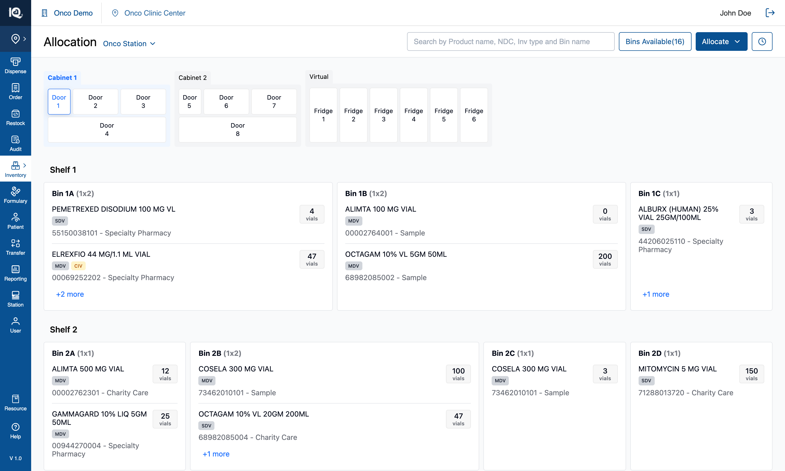
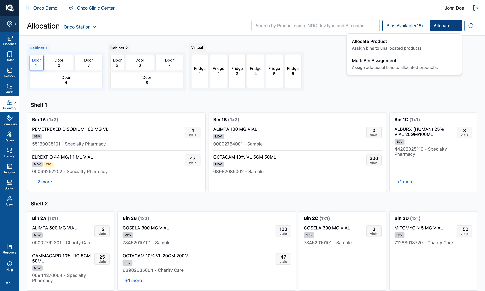
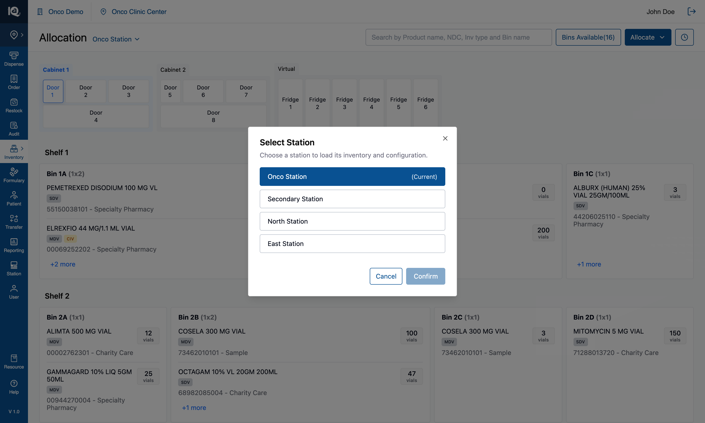
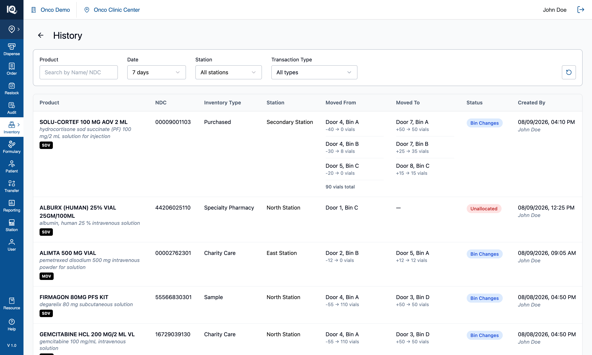

# 07 — Station Switcher and clinic level

**Surface:** the top bar's clinic label, the station link beside the page title, and the station picker
**Job:** distinguish an operator standing at a cabinet from one working elsewhere in the building
**Prototype files:** `App.tsx` (`accessLevel`), `TopNav.tsx`, `HeaderSection.tsx`, `StationSelectionModal.tsx`, `HistoryPage.tsx`
**Captured:** 2026-08-10 · seed data unmodified · screenshots at 1512×908

Read [00-Introduction.md](00-Introduction.md) first. This document is the one place the **two access
levels** are described; every other feature document is written from station level, which is the default.

---

## Default state — station level {copy}

The app opens at **station level**: the operator is physically in front of a cabinet, and everything
applies. The top bar names the practice, the clinic and the station, with the station as a chip that
opens the picker. The page title is `Allocation` alone, and the workflow trigger reads
**`Allocate/Move`** with all four entries behind it.

From here the operator can do everything the other six documents describe. Tapping **`Onco Clinic Center`**
switches to clinic level.

## Interaction state — clinic level {copy}

At **clinic level** the operator is elsewhere in the building with no cabinet in reach. Four things change
and nothing else does:

| | Station level | Clinic level |
|---|---|---|
| Workflow trigger | `Allocate/Move` | **`Allocate`** — it offers no Move, so it does not promise one |
| Workflows offered | All four | **Allocate Product** and **Multi Bin Assignment** only |
| Station name | A chip in the top bar | **Beside the page title**, as `Onco Station ▾` |
| Top bar | Practice · clinic · station | Practice · clinic (the station chip and its divider go together) |

`Bins Available` and `History` stay at both levels — both are read-only, and a clinic user arguably needs
the ledger more, having no cabinet to look at. The cabinet, its doors, search, product detail and the
zero-inventory banner are all unchanged.

From here the operator can allocate exactly as they would at a station, switch which station they are
working on, and read History across the whole clinic (§3). **Refreshing returns to station level** — that
is the only way back, by design.

The two Move entries are **withheld, not disabled**. Moving stock is a physical act — open a door, take
vials out of one bin, put them in another — so away from the cabinet it is not a job that can be started
and finished, and a greyed row would invite asking why. Allocation survives the distance because it
decides where stock *should* live.

## The station picker {copy}

The station name beside the title opens a modal listing the clinic's stations, with the current one filled
in `#095192` and marked `(Current)`. `Confirm` commits; `Cancel` leaves the current station alone.
`Confirm` is dimmed until a different station is picked, and keeps its name rather than stating a
requirement — the word is the control's identity.

Four sample stations are hard-coded: **Onco Station**, **Secondary Station**, **North Station**,
**East Station**.

**Switching station changes the name only.** Every station shows the same seeded cabinet, because
per-station cabinet and fridge configuration is deliberately not modelled yet (§4.1). The picker is also
reachable from the top bar's station chip at station level — one modal, one handler, so the two places can
never disagree about which station is current.

---

## 1. Behaviour

### 1.1 Switching level

- `Onco Clinic Center` in the top bar switches **station → clinic**.
- **One-way.** There is no in-app way back; a refresh returns to station level. That follows from the app
  holding all state in memory, so it needed no reset mechanism of its own.
- The label carries no active styling. Three signals already say where you are: the station name moves to
  the page title, the trigger drops `Move`, and the top bar loses the station chip. `aria-pressed` reports
  the level for anyone not reading the layout.

### 1.2 The switch is refused while a workflow is open

Tapping the clinic label with the Unallocated tray, an assignment panel, a move pipeline, Review, or
either step-④ screen open does **not** switch. It raises:

> Finish or cancel what you are working on before switching to clinic level.

A selection built across several searches, or a move halfway through Review, is not something to discard
as a side effect of tapping a clinic name. The alternative — closing the workflow — was considered and
rejected for that reason; refusing in silence was rejected because a control that declines without saying
so is indistinguishable from a broken one.

**The guard reads one expression covering all six surfaces.** A new workflow must be added to it, or
switching level will strand it: its entry points disappear while its state survives.

### 1.3 The level holds on every page

`History` and the product detail page render their own top bar, and both are handed the level. Without it
they drew the station-level shape — station chip back, divider back — which reads as having been dropped a
level by opening a ledger.

---

## 2. What each level may do

| | Station | Clinic |
|---|---|---|
| Browse cabinets, doors, bins | ✅ | ✅ |
| Search, highlight, product detail | ✅ | ✅ |
| `Bins Available` filter | ✅ | ✅ |
| [Allocate Product](02-Allocate-Product.md) | ✅ | ✅ |
| [Multi Bin Assignment](03-Multi-Bin-Assignment.md) | ✅ | ✅ |
| [Move from Bin](04-Move-from-Bin.md) | ✅ | ❌ |
| [Move from Product](05-Move-from-Product.md) | ✅ | ❌ |
| [History](06-History.md) | ✅ | ✅ — with a Station column and filter |
| Unallocate from the product page | ✅ | ✅ |

Note what is **not** gated: allocation can still put a product into any bin of any door or fridge at clinic
level, including bins the operator cannot see. That is consistent with allocation being a decision rather
than a physical act, but it means a clinic user can allocate into a cabinet they are nowhere near.

---

## 3. History across a clinic

At clinic level the ledger is read across several stations, so it gains two things — see
[06-History.md](06-History.md) for everything else about the page:

- **A `Station` column**, placed ahead of `Moved From` / `Moved To`: it says where the transaction
  happened, and those two say where within it.
- **A `Station` filter**, whose options are read from the entries themselves — so it can neither offer a
  station with nothing behind it nor hide one that has rows. It ANDs with the product, date and type
  filters, and the reset control clears it.

Every entry is stamped with the station it was written at, when it is written. The seeded ledger is spread
deterministically across the four stations so the filter has more than one answer. **An entry with no
station renders an em dash** rather than being assumed to belong to whichever station is current — a ledger
that guesses where something happened is worse than one that admits it does not know.

At station level neither the column nor the filter renders: the operator works one cabinet, so both would
restate the only station there is.

---

## 4. Implementation in the prototype

| Concern | Where |
|---|---|
| The level | `accessLevel: 'station' \| 'clinic'` in `App.tsx`, defaulting to `'station'` |
| The switch, and its refusal | `handleClinicClick` in `App.tsx`, guarded by `workflowInProgress` |
| Top bar | `TopNav.tsx` — the clinic label is the switch; the station chip and its divider are withheld at clinic level |
| Station link + menu gating | `HeaderSection.tsx`, prop `isClinicLevel` |
| Picker | `StationSelectionModal.tsx` — four hard-coded stations |
| Station on entries | `useInventoryState(currentStation)` stamps every history entry; `AllocationHistoryEntry.station` |
| Clinic History | `HistoryPage.tsx`, prop `isClinicLevel` |

Every prop defaults to station behaviour, so a caller that passes nothing keeps what it had — which is why
adding this feature could not change station level. The station is a **plain argument** to
`useInventoryState` rather than state inside it, so a station change is reflected by the next entry with
no effect to keep in sync.

---

## 5. Notes and open questions

### 5.1 Stations are a name, not a configuration

Every station shows the same cabinet. Real stations differ in cabinets, doors and fridges, and modelling
that was explicitly deferred. Two consequences for the real build:

- Switching station must reload that station's cabinet configuration, which makes it a data-fetching
  boundary rather than a label change — and raises the question of what happens to an open selection when
  the underlying bins change. Today the switch is allowed at any time because nothing depends on it.
- The picker's four names are hard-coded in the modal. They should come from the clinic.

### 5.2 The level is not a permission

`accessLevel` is UI state in one component, set by tapping a label. Anything relying on it as a
restriction — "this user may not move stock" — has to be enforced server-side; hiding two menu entries is
presentation. The real system presumably derives the level from where the session is, not from a click.

### 5.3 One-way by design, which suits a demo and not a product

Refreshing is the only way back to station level. That was the ask for the demo. A real build needs the
level to follow the context the user is actually in, at which point "switching back" stops being a UI
question.

### 5.4 Station level still shows every station's history

At station level the ledger includes other stations' transactions, with no column saying so. Scoping it to
the current station is a one-line filter, deliberately not applied — it changes existing behaviour, and
whether a station user should see the clinic's whole history is a product question.

### 5.5 Test assertions worth writing

1. With no props passed, every affected component renders its station-level shape.
2. At clinic level the workflow menu contains exactly the two allocation entries, and the trigger reads
   `Allocate`.
3. Tapping the clinic label with any workflow open leaves the level unchanged, leaves the workflow
   untouched, and raises the toast.
4. The level survives navigation to History and to a product's detail page.
5. Every history entry written at station X carries station X, whichever workflow wrote it.
6. The Station filter's options equal the distinct stations present in the ledger, and narrowing to one
   leaves only that station's rows.
7. A reload returns to station level.
